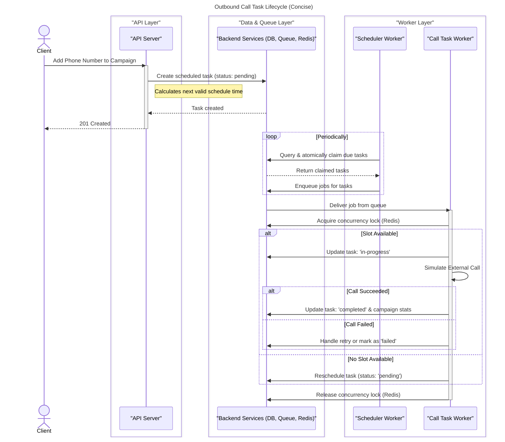

# Outbound Voice Campaign Microservice

Microservice designed to manage and execute outbound voice call campaigns. It extends a basic call-triggering API to support creating, scheduling, and monitoring campaigns with multiple calls. The system is built to be robust, scalable, and fault-tolerant, handling business hour constraints, concurrency limits, and automated retries.

## Features

-   **Campaign Management:** Create, update, retrieve, and delete call campaigns. Each campaign groups multiple phone numbers for unified tracking.
-   **Business Hour Scheduling:** Define specific time windows (including time zones) during which calls can be made. The system automatically schedules calls to respect these business hours.
-   **Concurrency Control:** Configure the maximum number of concurrent calls for each campaign to manage load and adhere to provider limits. A default limit is applied if not specified.
-   **Automated Retry Handling:** Automatically retries failed calls based on a configurable number of attempts and delay, prioritizing retries over new calls.
-   **Comprehensive Status Tracking:** Monitor the status of individual calls (`in-progress`, `completed`, `failed`) and the overall campaign (`pending`, `in-progress`, `completed`, `failed`).
-   **Aggregated Statistics:** Campaigns provide real-time statistics, including total calls, completed calls, failed calls, and retries attempted.
-   **API Documentation:** The API is fully documented using OpenAPI (Swagger), providing an interactive way to explore and test the endpoints.
-   **Background Job Processing:** Utilizes a robust queueing system with background workers to handle call scheduling and execution asynchronously.

## System Design and Architecture

The system is designed using a microservice architecture that separates the API, database, and background processing concerns. This separation allows for independent scaling and improved fault tolerance.

### High-Level Architecture



The architecture consists of the following core components:

1.  **Express API Server:** The primary entry point for clients. It exposes a RESTful API for managing users, phone numbers, call schedules, and campaigns. It is responsible for handling synchronous requests, validating input, and creating initial records in the database.
2.  **PostgreSQL Database:** The single source of truth for all persistent data. It stores information about users, campaigns, phone numbers, schedules, and call logs. The schema is designed with clear relationships and indexes for efficient querying.
3.  **Redis & BullMQ:** This forms the backbone of our asynchronous processing.
  *   **Redis** serves as both a message broker for BullMQ and a fast in-memory store for managing concurrency locks.
  *   **BullMQ** is used to manage job queues for call tasks. When a call needs to be made, a job is pushed to the `call-tasks` queue.
4.  **Background Workers:** These are independent Node.js processes that listen for jobs on the BullMQ queues.
  *   **Call Scheduler Worker (`callSchedulerWorker.ts`):** Periodically queries the database for pending call tasks that are due to be executed. It enqueues them into the `callTaskQueue` for processing. This worker is responsible for respecting the `scheduled_at` time.
  *   **Call Task Worker (`callTaskWorker.ts`):** This worker consumes jobs from the `callTaskQueue`. It is responsible for executing the "call" (a mock implementation), handling concurrency limits, updating call statuses, and implementing the retry logic.

### Component Interaction Flow

1.  **Campaign Creation:** A client sends a request to the **Express API** to create a campaign. The API validates the request and creates a new `call_campaigns` record in the **PostgreSQL** database.
2.  **Adding Phone Numbers:** The client adds phone numbers to the campaign via the API. For each number, the system calculates the next valid `scheduled_at` time based on the campaign's schedule and creates a `call_tasks` record with a `pending` status.
3.  **Scheduling Calls:** The **Call Scheduler Worker** runs periodically (e.g., every minute). It queries the database for `pending` tasks whose `scheduled_at` time is approaching. It then enqueues these tasks into the **BullMQ** `call-tasks` queue.
4.  **Executing Calls:** The **Call Task Worker** picks up a job from the queue.
  *   It first checks a **Redis** counter to see if the campaign's `max_concurrent_calls` limit has been reached.
  *   If a slot is available, it "initiates" the call (simulated), updates the task status to `in-progress`, and creates a `call_logs` record.
  *   Upon call completion (or failure), it updates the task and campaign statistics in **PostgreSQL**.
  *   If the call fails, it checks the retry configuration. If retries are remaining, it updates the `scheduled_at` time for a future attempt and sets the status back to `pending`. Otherwise, it marks the task as `failed`.
5.  **Status Tracking:** The client can poll the API at any time to get the latest status and statistics for a campaign, which are read directly from the **PostgreSQL** database.

### Technology Choices

*   **Node.js with Express & TypeScript:** Chosen for its strong performance in I/O-bound operations, vast ecosystem, and the type safety provided by TypeScript, which is crucial for building reliable, production-quality applications.
*   **PostgreSQL:** Relational database known for transaction control, data integrity. The call worker uses atomic db lock for distributed scheduling.
*   **Redis:** An in-memory data store used for its speed. It's a perfect fit for managing BullMQ's job queue and for implementing distributed locks and counters for concurrency control.
*   **BullMQ:** A robust and fast job queue system built on top of Redis. It provides essential features like job prioritization, rate limiting, and detailed monitoring, which are critical for a background processing system.
*   **Prisma:** A ORM that makes database access easy and type-safe. It simplifies queries and migrations, improving developer productivity.

### Fault Tolerance and Scalability

*   **Fault Tolerance:**
  *   **Decoupling:** The API and workers are decoupled via Redis. If the workers go down, the API can still accept requests and enqueue tasks. The workers will process the backlog once they come back online.
  *   **Retries:** The system has built-in retry logic for both transient job failures (handled by BullMQ) and application-level call failures (handled by the `callTaskWorker`).
  *   **Persistence:** All state is persisted in PostgreSQL, ensuring that no data is lost if a service restarts.
  * **Idempotency** Both the workers the scheduler and call task are idempotent in nature, you can n number of these workers and it won't conflict.
*   **Scalability:**
  *   **Stateless API:** The Express API is stateless, allowing you to run multiple instances behind a load balancer to handle increased incoming traffic.
  *   **Worker Scaling:** The number of background workers can be scaled independently of the API. If call processing becomes a bottleneck, you can simply deploy more worker instances to increase throughput. Just start new instance of worker.
  *   **Database Scaling:** PostgreSQL can be scaled vertically or horizontally (using read replicas) to handle higher query loads or it can be physically or logically sharded.

## API Documentation

The API is documented using the OpenAPI 3.0 standard. You can access the interactive Swagger UI documentation when the server is running:

*   **Swagger UI:** [http://localhost:3000/api-docs](http://localhost:3000/api-docs)
*   **OpenAPI JSON Spec:** [http://localhost:3000/api-docs.json](http://localhost:3000/api-docs.json)

You can also monitor the status of the background job queues using the Bull Board UI:

*   **Bull Board:** [http://localhost:3000/admin/queues](http://localhost:3000/admin/queues)

## Setup and Installation

### Prerequisites

*   [Docker](https://www.docker.com/get-started) and [Docker Compose](https://docs.docker.com/compose/install/)
*   [Node.js](https://nodejs.org/) (v18 or higher)
*   [npm](https://www.npmjs.com/) (or yarn)

### Local Setup

1.  **Clone the repository:**
    ```bash
    git clone https://github.com/raja-jamwal/express-call-campaign.git
    cd express-call-campaign
    ```

2.  **Install dependencies:**
    ```bash
    npm install
    ```

3.  **Start the database and Redis using Docker:**
    This command will start PostgreSQL and Redis in the background and initialize the database schema from `db.sql`.
    ```bash
    npm run docker:up
    ```

4.  **Generate Prisma Client:**
    This step is necessary to generate the type-safe Prisma client based on your schema.
    ```bash
    npx prisma generate
    ```

## Running the Application

The application consists of three main processes that need to be run in separate terminal windows.

1.  **Start the API Server:**
    ```bash
    npm run dev
    ```
    The API server will be available at `http://localhost:3000`.

2.  **Start the Call Scheduler Worker:**
    This worker is responsible for finding due tasks and queueing them.
    ```bash
    npm run worker:call-scheduler
    ```

3.  **Start the Call Task Worker:**
    This worker processes the jobs from the queue to execute calls.
    ```bash
    npm run worker:call
    ```

